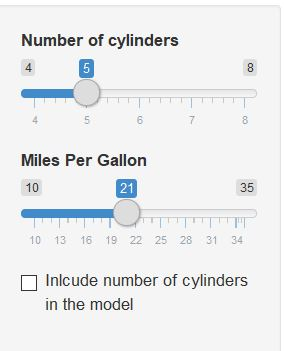
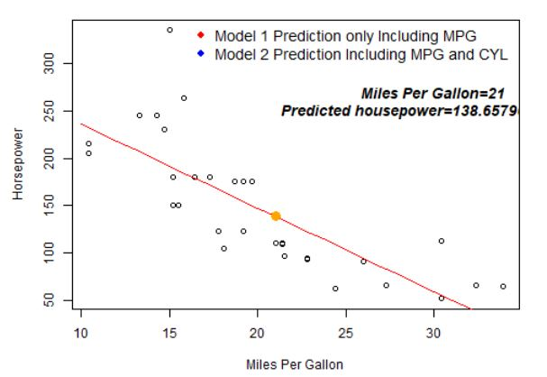
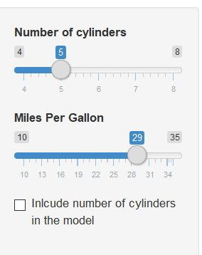
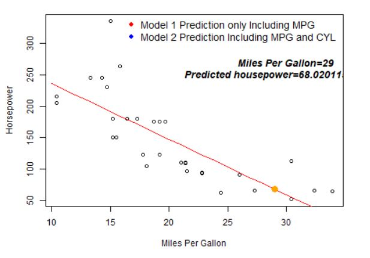
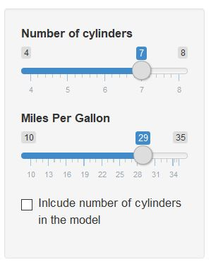
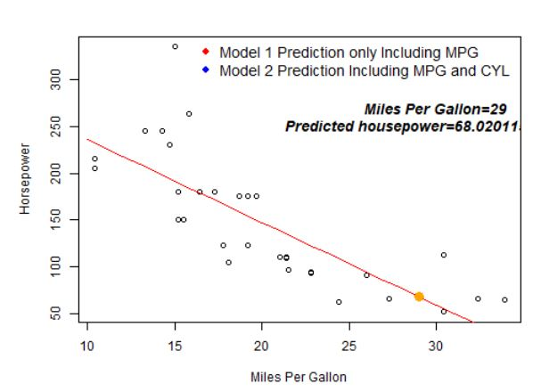
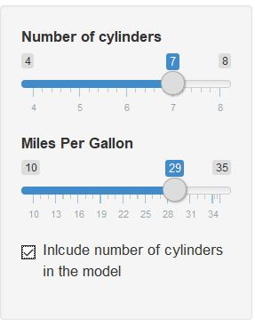
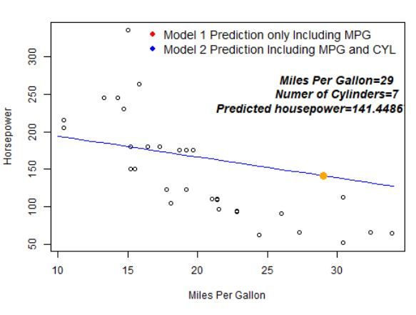

## Summary

```{css, echo = FALSE}

.highlight {
  background-color: lightpink;
  border: 3px solid red;
  font-weight: bold;
}

.center {
  display: block;
  margin-left: auto;
  margin-right: auto;
  width: 50%;
}

tr:nth-child(even){background-color: #f2f2f2}

th {
  font-family:Arial;
  width:200px;
  background-color: white;
  color: grey;
  font-size: 30pt
}

td{font-size: 14pt}

body{
  width:200px;
  font-size: 24pt;
  color: Darkblue;
}
p{
  font-size: 18pt;
  color: grey;
}
ul {list-style-type: disc;}
li{
  font-size: 18pt;
  color: grey;
}

h2.title {
  font-size: 24px;
  color: Gray;
}
h1 { /* Header 1 */
  font-size: 28px;
  color: Dark;
}
h2 { /* Header 2 */
    font-size: 30px;
  color: Darkblue;
}
h3 { /* Header 3 */
  font-size: 20px;
  font-family: "Times New Roman", Times, serif;
  color: DarkBlue;
}
code.r{ /* Code block */
    font-size: 20px;
}
pre { /* Code block - determines code spacing between lines */
    font-size: 20px;
}
```

- This is an app to predict the horsepower in dataset mtcars.
- Basiclly, we will use only miles per gallon to predict the horsepower.
- Also, in the sidebar, you can choose to add the number of cylinders in to the model,
and to predict the horsepower.
- The data used in the app comes from mtcars.

```{r, comment = "", message = FALSE }
library(kableExtra)
summary(mtcars[, c("mpg", "cyl", "hp")]) 
plot(mtcars$mpg, mtcars$hp, xlab = "Miles Per Gallon", ylab = "Horsepower")
```


## Only use miles per gallon

- In this situation, please don't choose ***Include number of cylinders***.
- In the plot, you will see a red curve.
- You can change the value of miles per gallon in the sidebar. The value and the 
  predicted horse power will be shown on the right-upper corner in the graph.
- Attention, in this situation, it will change nothing when you change the number of 
cylinders.

<center></center>

## Only use miles per gallon

- Change the value of miles per gallon.
<center></center>
- Change the number of cylinders.
<center></center>


## Include both miles per gallon and the number of cylinders

- In this situation, please choose ***Include number of cylinders***.
- In the plot, you will see a blue curve.
- You can change the value of miles per gallon and the number of cylinders in the sidebar. 
- Attention, in this situation, both miles per gallon and the number of cylinders will 
  determine the predicted horsepower.
  <center></center>


